SIG07 Interaction Viz
================
Eric Y. Wang
2024-12-04

- [Goals](#goals)
- [Import Data](#import-data)
- [Helper functions](#helper-functions)
- [Number of Interactions](#number-of-interactions)
- [Distribution of interaction
  effects](#distribution-of-interaction-effects)
  - [Interaction genes across
    ligands](#interaction-genes-across-ligands)
  - [Interacting genes for each
    ligand](#interacting-genes-for-each-ligand)
- [Directionality of interaction
  effects](#directionality-of-interaction-effects)
- [Strong emergent effects](#strong-emergent-effects)
- [Specific interesting cases](#specific-interesting-cases)
  - [IL12 interaction effects](#il12-interaction-effects)
  - [IL4 IFNA interaction effect](#il4-ifna-interaction-effect)
  - [IL2/4 vs IL27 interaction](#il24-vs-il27-interaction)
  - [IL4 vs IL6/IL21 interaction
    effects](#il4-vs-il6il21-interaction-effects)

``` r
library(tidyverse)
```

    ## Warning: package 'tidyr' was built under R version 4.4.2

    ## Warning: package 'dplyr' was built under R version 4.4.2

    ## ── Attaching core tidyverse packages ──────────────────────── tidyverse 2.0.0 ──
    ## ✔ dplyr     1.1.4     ✔ readr     2.1.5
    ## ✔ forcats   1.0.0     ✔ stringr   1.5.1
    ## ✔ ggplot2   3.5.1     ✔ tibble    3.2.1
    ## ✔ lubridate 1.9.3     ✔ tidyr     1.3.1
    ## ✔ purrr     1.0.2     
    ## ── Conflicts ────────────────────────────────────────── tidyverse_conflicts() ──
    ## ✖ dplyr::filter() masks stats::filter()
    ## ✖ dplyr::lag()    masks stats::lag()
    ## ℹ Use the conflicted package (<http://conflicted.r-lib.org/>) to force all conflicts to become errors

``` r
library(ggrepel)
```

    ## Warning: package 'ggrepel' was built under R version 4.4.2

``` r
library(patchwork)
```

    ## Warning: package 'patchwork' was built under R version 4.4.2

``` r
knitr::opts_chunk$set(echo = TRUE)
```

``` r
source("functions/plotting_fxns.R")
theme_set(theme_Publication())
```

## Goals

Visualize and examine the interaction effects as determined by
gene-level Gamma Poisson GLM modeling. As a reminder, the GLM is
expressed as follows:

$$
\log(\mu_i) = \beta_0 + \beta_1 (\text{ligand1}_i) + \beta_2 (\text{ligand2}_i) + \beta_3 (\text{ligand1}_i \cdot \text{ligand2}_i) + \beta_4 (\text{group}_i) + \beta_5 (\text{percent.mito}_i) + \beta_6 (\text{s.score}_i) + \beta_7 (\text{g2m.score}_i) + \log(\text{total_counts}_i)
$$

Where:

- $\mu_i$: The expected counts for observation $i$.
- $\beta_0$: The intercept term (baseline level of expression).
- $\beta_1$ to $\beta_7$: Coefficients representing the effect sizes of
  the predictors.
- $\text{ligand1}_i$: The value of `ligand1` for observation $i$.
- $\text{ligand2}_i$: The value of `ligand2` for observation $i$.
- $\text{ligand1}_i \cdot \text{ligand2}_i$: The interaction effect
  between `ligand1` and `ligand2`.
- $\text{group}_i$: The biological group variable (different mice).
- $\text{percent.mito}_i$: The percentage of mitochondrial RNA for
  observation $i$.
- $\text{s.score}_i$: The S-phase cell cycle score for observation $i$.
- $\text{g2m.score}_i$: The G2/M-phase cell cycle score for observation
  $i$.
- $\text{total_counts}_i$: The scaling factor for sequencing depth.

## Import Data

Here, the LFCs are calculated from the GLM by performing QLRTs for the
interaction term and each individual ligand. The DEG file is just for
reference and it is from a simple wilcoxon test performed in scanpy.

``` r
# import LFC from glm model
interactionsLfc <- read_csv("analysis_outs/glmGamPoi_interaction_deg.csv")
```

    ## Rows: 159237 Columns: 8
    ## ── Column specification ────────────────────────────────────────────────────────
    ## Delimiter: ","
    ## chr (2): name, interaction
    ## dbl (6): pval, adj_pval, f_statistic, df1, df2, lfc
    ## 
    ## ℹ Use `spec()` to retrieve the full column specification for this data.
    ## ℹ Specify the column types or set `show_col_types = FALSE` to quiet this message.

``` r
interSig <- interactionsLfc %>% filter(adj_pval < 0.1)
singlesLfc <- read_csv("analysis_outs/glmGamPoi_singles_deg.csv")
```

    ## Rows: 318474 Columns: 9
    ## ── Column specification ────────────────────────────────────────────────────────
    ## Delimiter: ","
    ## chr (3): name, interaction, single_ligand
    ## dbl (6): pval, adj_pval, f_statistic, df1, df2, lfc
    ## 
    ## ℹ Use `spec()` to retrieve the full column specification for this data.
    ## ℹ Specify the column types or set `show_col_types = FALSE` to quiet this message.

``` r
# import DEGs from scanpy
degWilcox <- read_csv("analysis_outs/deg_wilcoxon.csv")
```

    ## Rows: 375840 Columns: 7
    ## ── Column specification ────────────────────────────────────────────────────────
    ## Delimiter: ","
    ## chr (2): group, names
    ## dbl (5): scores, logfoldchanges, pvals, pvals_adj, pct_nz_group
    ## 
    ## ℹ Use `spec()` to retrieve the full column specification for this data.
    ## ℹ Specify the column types or set `show_col_types = FALSE` to quiet this message.

``` r
interSig$interaction %>% unique()
```

    ##  [1] "IL4_IL12"  "IL4_IFNA"  "IL4_IL6"   "IL4_IL2"   "IL4_TNF"   "IL4_IL21" 
    ##  [7] "IL4_IL27"  "IL12_IFNA" "IL12_IL6"  "IL12_IL2"  "IL12_TNF"  "IL12_IL21"
    ## [13] "IL12_IL27" "IFNA_IL6"  "IFNA_IL2"  "IFNA_TNF"  "IFNA_IL21" "IFNA_IL27"
    ## [19] "IL6_IL2"   "IL6_TNF"   "IL6_IL21"  "IL6_IL27"  "IL2_TNF"   "IL2_IL21" 
    ## [25] "IL2_IL27"  "TNF_IL21"  "TNF_IL27"  "IL21_IL27"

## Helper functions

``` r
make_xy_plot <- function(ligand_pair, interactions, singles,
                         p_val_cutoff=0.1, lfc_cutoff=0.25){
  # Function to create an XY plot comparing log-fold changes (LFC) for two ligands in a pair.
  # Inputs:
  # - ligand_pair: A string specifying the ligand pair, e.g., "IL4_IFNA".
  # - interactions: Dataframe containing interaction data with columns `name`, `lfc`, `adj_pval`, `interaction`.
  # - singles: Dataframe containing single ligand data with columns `name`, `lfc`, `adj_pval`, `single_ligand`.
  # - p_val_cutoff: P-value cutoff for filtering significant interactions (default = 0.1).
  # - lfc_cutoff: Log-fold change cutoff for filtering significant interactions (default = 0.25).

  # Split the ligand pair (e.g., "IL4_IFNA") into individual ligands
  ligands <- str_split_1(ligand_pair, pattern = "_")
  
  # Filter and process the singles data
  singles <- singles %>%
    filter(single_ligand %in% ligands) %>%
    filter(interaction == ligand_pair) %>%
    select(name, adj_pval, lfc, single_ligand) %>%
    pivot_wider(
      names_from = single_ligand,         
      values_from = c(adj_pval, lfc),       
      names_sep = "_"                       
    )

  # Filter and process the interaction data
  interactions <- interactions %>%
    filter(adj_pval < p_val_cutoff) %>%
    filter(interaction == ligand_pair) %>%
    filter(abs(lfc) > lfc_cutoff) %>%
    left_join(singles, by = "name")

  # Define vlag palette
  vlag_palette <- c("#B2182B", "#D6604D", "#F4A582", "#FDDBC7", "#FFFFFF",
                    "#D1E5F0", "#92C5DE", "#4393C3", "#2166AC") %>% rev()

  # Set the limits for the log-fold change scale, rounded up to one decimal place
  lfc_max <- ceiling(max(abs(interactions$lfc)) * 10) / 10

  # plot
  ggplot(interactions, aes(x=.data[[paste0("lfc_",ligands[1])]],
                           y=.data[[paste0("lfc_",ligands[2])]],
                           fill=lfc,
                           size = -log10(adj_pval))) +
    geom_point(shape=21, alpha=0.7) +
    scale_fill_gradientn(
      colors = vlag_palette,
      limits = c(-lfc_max, lfc_max)
    ) +
    geom_hline(yintercept=0, linetype="dashed") +
    geom_vline(xintercept=0, linetype="dashed") +
    theme(aspect.ratio=1)
}
```

``` r
plot_lfc_pair <- function(genes, ligand_pair, deg_data) {
  # Function to plot log-fold changes (LFC) for interaction and single ligands given a vector of genes
  
  # Split the ligand pair (e.g., "IL4_IFNA") into individual ligands (e.g., "IL4" and "IFNA")
  ligands <- str_split_1(ligand_pair, pattern = "_")
  
  # Filter and process the input differential expression (DEG) data
  deg_data %>%
    filter(
      # Select only rows where the group matches the ligands and their interaction
      group %in% c(
        paste0(ligands[1], "_linker"),  # Single ligand 1 with "_linker"
        paste0(ligands[2], "_linker"),  # Single ligand 2 with "_linker"
        ligand_pair                     # Interaction of both ligands
      )
    ) %>%
    # Convert the `group` column into a factor to ensure consistent ordering
    mutate(group = factor(
      group,
      levels = c(
        paste0(ligands[1], "_linker"),  # First ligand "_linker"
        paste0(ligands[2], "_linker"),  # Second ligand "_linker"
        ligand_pair                     # Combined ligand interaction
      )
    )) %>%
    # Keep only rows where the `names` column matches the genes of interest
    filter(names %in% genes) %>%
    
    # Create the plot
    ggplot(aes(x = names, y = logfoldchanges, fill = group)) +
      geom_bar(stat = "identity", position = position_dodge()) +
      xlab("genes") +
      ylab("LFC vs linker only") +
      scale_fill_brewer(palette = "Dark2")
}
```

## Number of Interactions

``` r
interactionsLfc %>%
  filter(adj_pval < 0.1) %>%
  filter(abs(lfc) > 0.25) %>%
  count(interaction, name = "count") %>%  # Count occurrences for each interaction
  arrange(desc(count)) %>%  # Arrange data by decreasing counts
  mutate(interaction = factor(interaction, levels = interaction)) %>%
  ggplot(aes(x = interaction, y = count)) +
    geom_bar(stat = "identity") +
    ylab("# interaction DEGs") +
    ggtitle("Interaction DEG # (padj < 0.1, lfc > 0.25)") +
    theme(axis.text.x = element_text(angle = 45, hjust = 1))
```

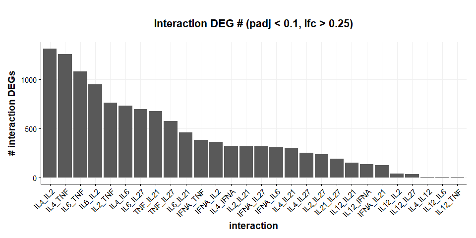<!-- -->

``` r
# Calculate total DEGs for individual ligands
totalDegs <- singlesLfc %>%
  filter(adj_pval < 0.1) %>%
  filter(abs(lfc) > 0.25) %>%
  select(name, interaction) %>%
  unique() %>%
  group_by(interaction) %>%
  summarise(total_degs = n())

# Count significant interactions
interactionCounts <- interactionsLfc %>%
  filter(adj_pval < 0.1) %>%
  filter(abs(lfc) > 0.25) %>%
  count(interaction, name = "count")

# Combine the two datasets
combinedData <- interactionCounts %>%
  full_join(totalDegs, by = "interaction") %>%
  mutate(interaction = factor(interaction, levels = interaction))  # Maintain original order

# Create the XY plot
ggplot(combinedData, aes(x = total_degs, y = count, label = interaction)) +
  geom_point(size = 2, alpha = 0.7) +  # Plot points
  geom_text_repel(size = 2) +
  xlim(0,4100) +
  labs(
    x = "Total Unique DEGs (Single Ligands)", 
    y = "Interaction DEGs", 
    title = "Total DEGs vs Interaction DEGs"
  )
```

<!-- -->

Somewhat unsurprisingly the number of interaction DEGs scales with the
total number of unique DEGs in the corresponding single ligand
stimulations. Notably though there **is variance** in the number of
interaction DEGs (e.g. the TNF interactions on the right hand side)
which is somewhat reassuring that the interaction effects isn’t just an
artifact of noise in the data.

## Distribution of interaction effects

One interesting question is whether the same genes have interaction
effects across different ligands or whether, for the same ligand, the
same genes tend to promiscuously have interaction effects when paired
with many different ligands. We’ll examine these one at a time

### Interaction genes across ligands

``` r
# get number of times gene is interacting across all ligands
interactGeneSummary <- interactionsLfc %>%
  filter(adj_pval < 0.01) %>%
  filter(abs(lfc) > 0.25) %>%
  group_by(name) %>%
  summarise(num_interactions = n(),
            median_lfc = median(abs(lfc)),
            median_pval = median(adj_pval))
```

``` r
ggplot(interactGeneSummary, aes(x = num_interactions)) +
  geom_histogram(bins = 20) +
  ggtitle("Distribution of Interaction Effects Across Ligands")
```

<!-- -->

``` r
library(ggpointdensity)
p1 <- ggplot(interactGeneSummary, aes(x = factor(num_interactions), y=abs(median_lfc))) +
  geom_point() + 
  scale_color_viridis_c() +
  ylab("Median LFC (abs value)") +
  xlab("number of interactions")
p2 <- ggplot(interactGeneSummary, aes(x = factor(num_interactions), y=-log10(median_pval))) +
  geom_point() + 
  scale_color_viridis_c() +
  ylab("Median -log10(padj)") +
  xlab("number of interactions")
p3 <- ggplot(interactGeneSummary, aes(x = factor(num_interactions), y=abs(median_lfc))) +
  geom_boxplot() +
  ylab("Median LFC (abs value)") +
  xlab("number of interactions")
p4 <- ggplot(interactGeneSummary, aes(x = factor(num_interactions), y=-log10(median_pval))) +
  geom_boxplot() +
  ylab("Median -log10(padj)") +
  xlab("number of interactions")

p1+p2+p3+p4+plot_layout(ncol=2)
```

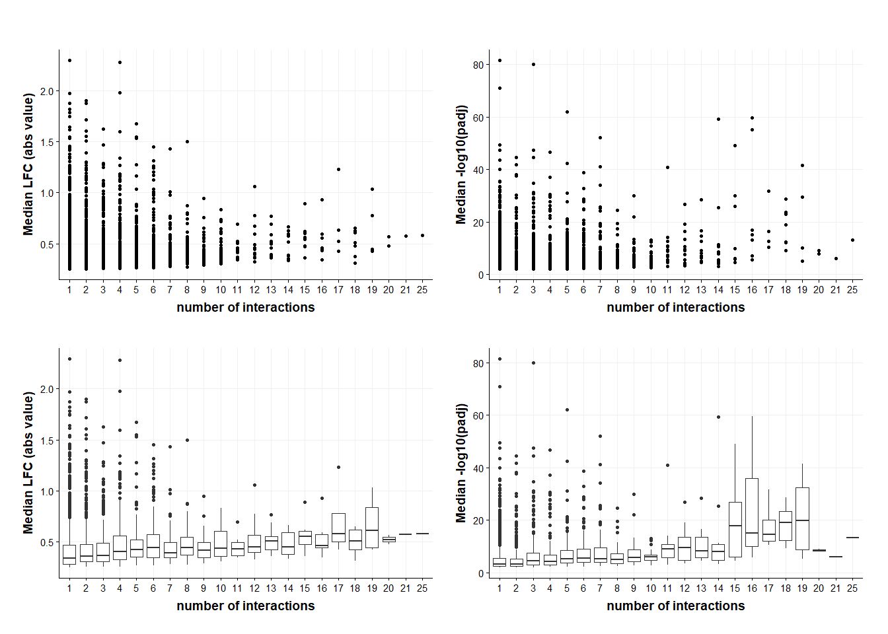<!-- -->

- Majority of genes with interaction effects are present in a relatively
  small number of interactions (perhaps just that they are somewhat
  ligand-specific and each ligand has 7 potential pairings)
- Genes with the highest median LFC and significance tend to be those
  with lower numbers of interactions, although genes with high numbers
  of interactions tend to have higher overall LFC and significance.
- A small subset of genes with promiscuous interaction effects are
  highly significant (see below).

``` r
# get promiscuous interactors with high significance
interactGeneSummary %>%
  filter(num_interactions > 10 & -log10(median_pval) > 20)
```

    ## # A tibble: 17 × 4
    ##    name    num_interactions median_lfc median_pval
    ##    <chr>              <int>      <dbl>       <dbl>
    ##  1 Bcl3                  18      0.511    2.07e-24
    ##  2 Cish                  15      0.892    1.30e-26
    ##  3 Dtx3l                 15      0.474    1.46e-26
    ##  4 Gvin1                 16      0.929    2.36e-60
    ##  5 Igfbp4                19      0.775    2.60e-42
    ##  6 Igtp                  18      0.650    1.18e-23
    ##  7 Irgm2                 13      0.766    4.17e-29
    ##  8 Jak3                  11      0.694    1.35e-41
    ##  9 Jund                  15      0.476    7.78e-50
    ## 10 Kbtbd11               14      0.598    5.20e-60
    ## 11 Mcl1                  14      0.335    4.31e-26
    ## 12 Samhd1                16      0.460    6.52e-56
    ## 13 Socs1                 19      1.03     4.21e-30
    ## 14 Socs3                 12      1.06     1.54e-27
    ## 15 Stat1                 15      0.602    8.01e-31
    ## 16 Tgtp1                 17      1.23     2.01e-32
    ## 17 Zbp1                  18      0.609    1.96e-29

``` r
# get promiscuous interactors with high significance
interactGeneSummary %>%
  filter(median_lfc > 1) %>%
  arrange(median_pval, ascending=T)
```

    ## # A tibble: 119 × 4
    ##    name    num_interactions median_lfc median_pval
    ##    <chr>              <int>      <dbl>       <dbl>
    ##  1 Tgtp1                 17       1.23    2.01e-32
    ##  2 Socs1                 19       1.03    4.21e-30
    ##  3 Socs3                 12       1.06    1.54e-27
    ##  4 Snn                    1       1.54    8.77e-27
    ##  5 Dhcr24                 1       1.04    8.57e-23
    ##  6 Smpdl3b                1       2.30    4.84e-21
    ##  7 Slc14a1                2       1.12    2.34e-13
    ##  8 Thrb                   1       1.62    2.54e-13
    ##  9 Tamalin                3       1.63    5.57e-11
    ## 10 Rragd                  6       1.20    5.87e-11
    ## # ℹ 109 more rows

**Random interesting relatively unique interactions just from scanning**

- IL6 + TNF -\> emergent Rorc upregulation (consistent with studies
  suggesting the role of Tnf in promoting Th17)
  - <https://www.pnas.org/doi/10.1073/pnas.2109972118>
- IL4 & IL2 + TNF -\> synergistic downregulation of Irf4 (role in Th1
  induction?)
- IL4 + TNF -\> emergent Thrb upregulation
- IFNA & IL27 + TNF -\> Cxcl10 upregulation
  - IL27 also leads to synergistic Tbx21 induction but not IFNA

``` r
p1 <- plot_lfc_pair(c("Rorc"),"IL6_TNF", degWilcox)
p2 <- plot_lfc_pair(c("Thrb","Snn","Irf4","Mdk"),"IL4_TNF", degWilcox)
p3 <- plot_lfc_pair(c("Irf4"),"IL2_TNF", degWilcox)
p6 <- plot_lfc_pair(c("Cxcl10", "Tbx21"),"IFNA_TNF", degWilcox)
p7 <- plot_lfc_pair(c("Cxcl10","Tbx21"),"IL27_TNF", degWilcox)

(p1+p3)/(p6+p7)/p2
```

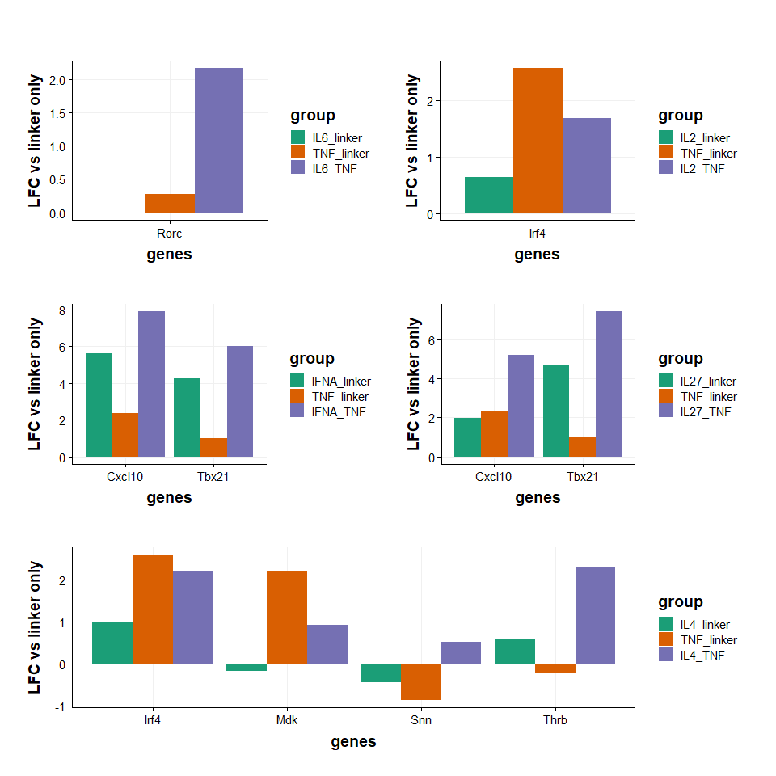<!-- -->

### Interacting genes for each ligand

For the DEGs present induced by each ligand alone, let’s see how many of
them have interaction effects and with how many of the pairs do they
have effects. The maximum number of pairs is 7 for any given ligand.

One thing to keep in mind with this analysis is I’m using DEGs derived
from wilcoxon test for the single stimulations and DEGs from the GLM
model for the interaction effects. Perhaps there are some differences in
pvalue distributions between these?

``` r
pair_single_double_deg <- function(deg, interactions, lfc_thresh = 0.25, pval_thresh = 0.01) {
  # LFC and pval filter both the single ligand DEGs and the interaction DEGs
  
  # Create tibble with only singles
  degSingles <- deg %>%
    filter(grepl("_linker", group)) %>%
    mutate(group = gsub("_linker", "", group)) %>%
    filter(pvals_adj < pval_thresh & abs(logfoldchanges) > lfc_thresh)
  
  # Create tibble with number of significant interaction effects per gene per ligand
  groupInteractSummary <- interactions %>%
    separate(interaction, into = c("interaction1", "interaction2"), sep = "_") %>%
    pivot_longer(cols = c(interaction1, interaction2), 
                 names_to = "interaction_type", 
                 values_to = "group") %>%
    select(-interaction_type) %>%
    filter(adj_pval < pval_thresh & abs(lfc) > lfc_thresh) %>%
    group_by(group, name) %>%
    summarise(num_interactions = n(),
              median_interaction_lfc = median(lfc),
              median_interaction_padj = median(adj_pval), .groups = "drop")
  
  # Merge dataset on interactions to single DEGs
  degSinglesInteract <- degSingles %>% 
    left_join(groupInteractSummary, by = c("group" = "group", "names" = "name")) %>%
    mutate(num_interactions = replace_na(num_interactions, 0))
  
  # Calculate summary statistics per group per number of interactions
  degSummarySI <- degSinglesInteract %>%
    group_by(group, num_interactions) %>%
    summarise(interact_count = n(), .groups = "drop") %>%
    group_by(group) %>%
    mutate(interact_freq = interact_count / sum(interact_count)) %>%
    mutate(num_interactions = as_factor(num_interactions))
  
  out <- vector(mode = "list", length = 2)
  out[[1]] <- degSinglesInteract
  out[[2]] <- degSummarySI
  return(out)
}
```

``` r
singleDoubleSig <- pair_single_double_deg(deg = degWilcox,
                                             interactions = interactionsLfc,
                                             lfc_thresh = 0,
                                             pval_thresh = 0.1)
singleDoubleSig[[2]]
```

    ## # A tibble: 60 × 4
    ## # Groups:   group [8]
    ##    group num_interactions interact_count interact_freq
    ##    <chr> <fct>                     <int>         <dbl>
    ##  1 IFNA  0                          2270       0.604  
    ##  2 IFNA  1                           681       0.181  
    ##  3 IFNA  2                           328       0.0873 
    ##  4 IFNA  3                           206       0.0548 
    ##  5 IFNA  4                           148       0.0394 
    ##  6 IFNA  5                            72       0.0192 
    ##  7 IFNA  6                            43       0.0114 
    ##  8 IFNA  7                             9       0.00240
    ##  9 IL12  0                             4       0.4    
    ## 10 IL12  1                             1       0.1    
    ## # ℹ 50 more rows

``` r
# make plots
p1 <- ggplot(singleDoubleSig[[2]], aes(x=group,y=interact_count,fill=num_interactions)) +
  geom_bar(stat = "identity", color = "black") +
  scale_fill_viridis_d(option = "turbo") +
  xlab("ligand") +
  ylab("# of DEGs\n in single ligand") +
  guides(fill=guide_legend(title="# of pairs\nwith interactions")) +
  ggtitle("Interacting genes per ligand\n(padj < 0.1)")
p2 <- ggplot(singleDoubleSig[[2]], aes(x=group,y=interact_freq,fill=num_interactions)) +
  geom_bar(stat = "identity", color = "black") +
  scale_fill_viridis_d(option = "turbo") +
  xlab("ligand") +
  ylab("frequency of DEGs\n in single ligand") +
  guides(fill=guide_legend(title="# of pairs\nwith interactions")) +
  ggtitle("Interacting genes per ligand\n(padj < 0.1)")

p1+p2
```

<!-- -->

``` r
singleDoubleSigStrict <- pair_single_double_deg(deg = degWilcox,
                                             interactions = interactionsLfc,
                                             lfc_thresh = 0.25,
                                             pval_thresh = 0.01)
singleDoubleSigStrict[[2]]
```

    ## # A tibble: 56 × 4
    ## # Groups:   group [8]
    ##    group num_interactions interact_count interact_freq
    ##    <chr> <fct>                     <int>         <dbl>
    ##  1 IFNA  0                          1323      0.759   
    ##  2 IFNA  1                           208      0.119   
    ##  3 IFNA  2                            88      0.0505  
    ##  4 IFNA  3                            61      0.0350  
    ##  5 IFNA  4                            36      0.0206  
    ##  6 IFNA  5                            22      0.0126  
    ##  7 IFNA  6                             5      0.00287 
    ##  8 IFNA  7                             1      0.000573
    ##  9 IL12  1                             1      0.333   
    ## 10 IL12  2                             1      0.333   
    ## # ℹ 46 more rows

``` r
# make plots
p1 <- ggplot(singleDoubleSigStrict[[2]], aes(x=group,y=interact_count,fill=num_interactions)) +
  geom_bar(stat = "identity", color = "black") +
  scale_fill_viridis_d(option = "turbo") +
  xlab("ligand") +
  ylab("# of DEGs\n in single ligand") +
  guides(fill=guide_legend(title="# of pairs\nwith interactions")) +
  ggtitle("Interacting genes per ligand\n(lfc > 0.25, padj < 0.01)")
p2 <- ggplot(singleDoubleSigStrict[[2]], aes(x=group,y=interact_freq,fill=num_interactions)) +
  geom_bar(stat = "identity", color = "black") +
  scale_fill_viridis_d(option = "turbo") +
  xlab("ligand") +
  ylab("frequency of DEGs\n in single ligand") +
  guides(fill=guide_legend(title="# of pairs\nwith interactions")) +
  ggtitle("Interacting genes per ligand\n(lfc > 0.25, padj < 0.01)")

p1+p2
```

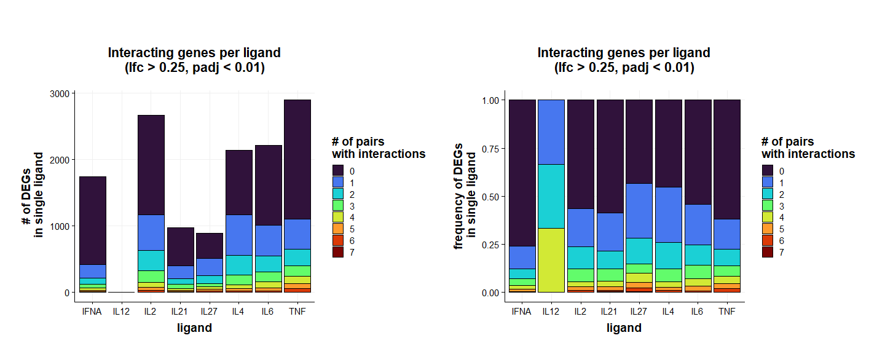<!-- -->

``` r
singleDoubleSigStrict2 <- pair_single_double_deg(deg = degWilcox,
                                             interactions = interactionsLfc,
                                             lfc_thresh = 1,
                                             pval_thresh = 0.01)
singleDoubleSigStrict2[[2]]
```

    ## # A tibble: 39 × 4
    ## # Groups:   group [8]
    ##    group num_interactions interact_count interact_freq
    ##    <chr> <fct>                     <int>         <dbl>
    ##  1 IFNA  0                           179       0.821  
    ##  2 IFNA  1                            27       0.124  
    ##  3 IFNA  2                            10       0.0459 
    ##  4 IFNA  3                             1       0.00459
    ##  5 IFNA  4                             1       0.00459
    ##  6 IL12  1                             1       1      
    ##  7 IL2   0                           182       0.679  
    ##  8 IL2   1                            60       0.224  
    ##  9 IL2   2                            16       0.0597 
    ## 10 IL2   3                             7       0.0261 
    ## # ℹ 29 more rows

``` r
# make plots
p1 <- ggplot(singleDoubleSigStrict2[[2]], aes(x=group,y=interact_count,fill=num_interactions)) +
  geom_bar(stat = "identity", color = "black") +
  scale_fill_viridis_d(option = "turbo") +
  xlab("ligand") +
  ylab("# of DEGs\n in single ligand") +
  guides(fill=guide_legend(title="# of pairs\nwith interactions")) +
  ggtitle("Interacting genes per ligand\n(lfc > 1, padj < 0.01)")
p2 <- ggplot(singleDoubleSigStrict2[[2]], aes(x=group,y=interact_freq,fill=num_interactions)) +
  geom_bar(stat = "identity", color = "black") +
  scale_fill_viridis_d(option = "turbo") +
  xlab("ligand") +
  ylab("frequency of DEGs\n in single ligand") +
  guides(fill=guide_legend(title="# of pairs\nwith interactions")) +
  ggtitle("Interacting genes per ligand\n(lfc > 1, padj < 0.01)")

p1+p2
```

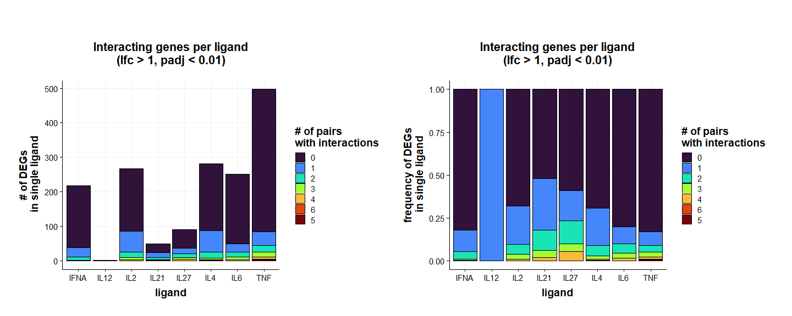<!-- -->

``` r
singleDoubleSig[[1]] %>%
  ggplot(aes(x = as_factor(num_interactions),
             y = logfoldchanges, fill = as_factor(num_interactions))) +
    geom_boxplot() +
    scale_fill_viridis_d(option = "viridis") +
    facet_wrap(~group, ncol = 4) +
    ylab("LFC in single ligand condition") +
    xlab("# of pairs with interactions") +
    ggtitle("Relationship of # of interactions with LFC\n(padj < 0.1)") +
    theme(legend.position = "none")
```

<!-- -->

``` r
singleDoubleSigStrict[[1]] %>%
  ggplot(aes(x = as_factor(num_interactions),
             y = logfoldchanges, fill = as_factor(num_interactions))) +
    geom_boxplot() +
    scale_fill_viridis_d(option = "viridis") +
    facet_wrap(~group, ncol = 4) +
    ylab("LFC in single ligand condition") +
    xlab("# of pairs with interactions") +
    ggtitle("Relationship of # of interactions with LFC\n(lfc > 1, padj < 0.01)") +
    theme(legend.position = "none")
```

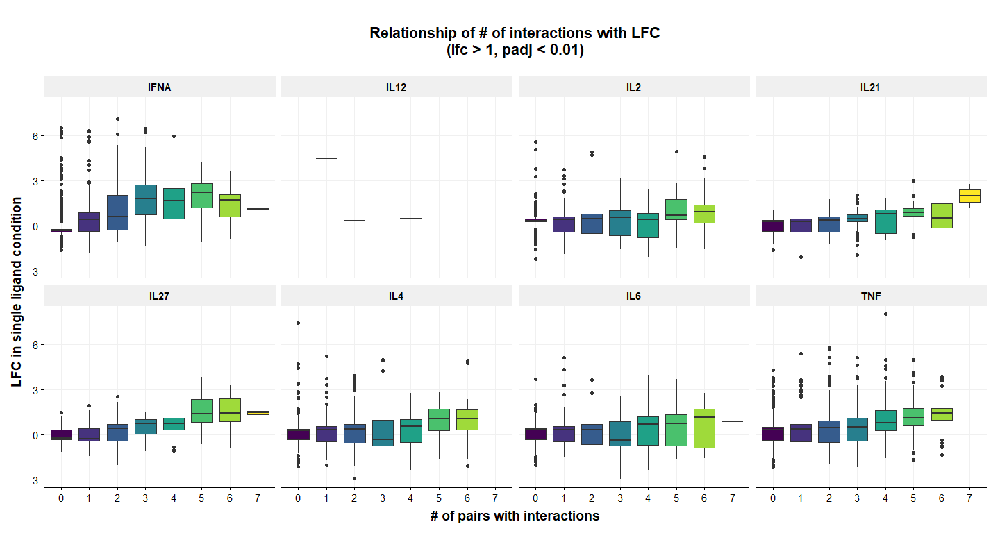<!-- -->

- A good proportion of DEGs from a given ligand have some interaction,
  although this varies based on the exact cutoff you use (stricter lfc
  and padj cutoff = fewer percentage of DEGs have interactions)
  - Given the relative uniqueness of IFNA genes, it’s somewhat expected
    to see that there are in general fewer genes with interactions for
    this ligand
  - IL-12 is interesting because at strict cutoffs, all of its DEGs have
    interaction effects with at least one other ligand. This is notable
    since IL-12 is a weird one (doesn’t induce much DEGs)
- A general trend is that the genes with higher numbers of interacting
  pairs for a given ligand have higher LFC in the single ligand
  condition. I guess this is reassuring but it also perhaps speaks to
  the fact that most interactions are these sort of antagonistic
  interactions between strong DEGs shared by two ligands.
  - Interestingly this trend is stronger for certain ligands than for
    others. For example, IFNA has many genes with strong DEG and no
    interactions but for IL27 and IL21, the correlation between \# of
    pairs with interactions and LFC for a given gene is very strong

## Directionality of interaction effects

``` r
singleDoubleSig[[1]] %>%
  mutate(median_interaction_lfc = replace_na(median_interaction_lfc,0)) %>%
  ggplot(aes(x = logfoldchanges, y = median_interaction_lfc)) +
    geom_pointdensity() +
    scale_color_viridis_c() +
    facet_wrap(~group, ncol = 4) +
    geom_hline(yintercept=0, linetype="dashed") +
    geom_vline(xintercept=0, linetype="dashed") +
    ylab("median LFC in interaction") +
    xlab("LFC in single ligand condition") +
    ggtitle("Relationship of interaction and single LFC\n(padj < 0.1)")
```

<!-- -->

``` r
singleDoubleSigStrict[[1]] %>%
  mutate(median_interaction_lfc = replace_na(median_interaction_lfc,0)) %>%
  ggplot(aes(x = logfoldchanges, y = median_interaction_lfc)) +
    geom_pointdensity() +
    scale_color_viridis_c() +
    facet_wrap(~group, ncol = 4) +
    geom_hline(yintercept=0, linetype="dashed") +
    geom_vline(xintercept=0, linetype="dashed") +
    ylab("median LFC in interaction") +
    xlab("LFC in single ligand condition") +
    ggtitle("Relationship of interaction and single LFC\n(padj < 0.1 & lfc > 0.25)")
```

<!-- -->

It’s clear that there’s some directional bias. Of note, some interaction
ligands have abs(LFC) \< cutoff because the median function takes the
mean when there’s only two samples. To get a better sense of this we can
focus on the interaction effects mapped onto the single-ligand effects
for each ligand pair.

``` r
library(patchwork)

# Uses make_xy_plot function to generate a grid of plots with all pairwise interactions
generate_pairwise_plot_grid <- function(unique_ligands, interactions, singles, p_val_cutoff = 0.1, lfc_cutoff = 0.25) {
  
  # Create an empty list to store the plots
  plot_list <- list()
  
  # create tibble with significant iteraction DEGs
  interSig <- interactions %>%
    filter(adj_pval < p_val_cutoff)
  
  # Iterate through ligand pairs and generate plots
  for (row_ligand in unique_ligands) {
    for (col_ligand in unique_ligands) {
      # For diagonal plots, make them empty
      if (row_ligand == col_ligand) {
        plot_list[[paste(row_ligand, col_ligand, sep = "_")]] <- ggplot() + 
          theme_void()
        next
      }
      
      # Determine the ligand pair
      ligand_pair <- paste(row_ligand, col_ligand, sep = "_")
      reverse_pair <- paste(col_ligand, row_ligand, sep = "_")
      
      if (ligand_pair %in% interSig$interaction) {
        # Plot for the top-right side
        plot <- make_xy_plot(
          ligand_pair = ligand_pair,
          interactions = interactions,
          singles = singles,
          p_val_cutoff = p_val_cutoff,
          lfc_cutoff = lfc_cutoff
        )
        # Remove text and labels
        plot <- plot +
          theme(legend.position = "none")
        plot_list[[paste(row_ligand, col_ligand, sep = "_")]] <- plot
      } else if (reverse_pair %in% interSig$interaction) {
        # Transpose the plot for the bottom-left side
        plot <- make_xy_plot(
          ligand_pair = reverse_pair,
          interactions = interactions,
          singles = singles,
          p_val_cutoff = p_val_cutoff,
          lfc_cutoff = lfc_cutoff
        )
        # Remove text and labels, and transpose axes
        plot <- plot +
          coord_flip() + # Transpose the plot
          theme(legend.position = "none")
        plot_list[[paste(row_ligand, col_ligand, sep = "_")]] <- plot
      } else {
        # Add an empty plot if no interaction exists
        plot_list[[paste(row_ligand, col_ligand, sep = "_")]] <- ggplot() + 
          theme_void()
      }
    }
  }
  
  # Arrange the plots in a symmetric grid
  plot_grid <- wrap_plots(plot_list,
                          nrow = length(unique_ligands),
                          ncol = length(unique_ligands)) +
    plot_layout(heights = rep(3, length(unique_ligands)),
                widths = rep(3, length(unique_ligands)))
  
  # Return the plot grid
  return(plot_grid)
}
```

``` r
# Extract unique ligands
unique_ligands <- unique(unlist(strsplit(interSig$interaction, "_")))

# Call the function
pairwisePlot <- generate_pairwise_plot_grid(
  unique_ligands = unique_ligands,
  interactions = interactionsLfc,
  singles = singlesLfc,
  p_val_cutoff = 0.1,
  lfc_cutoff = 0.25
)
pairwisePlot
```

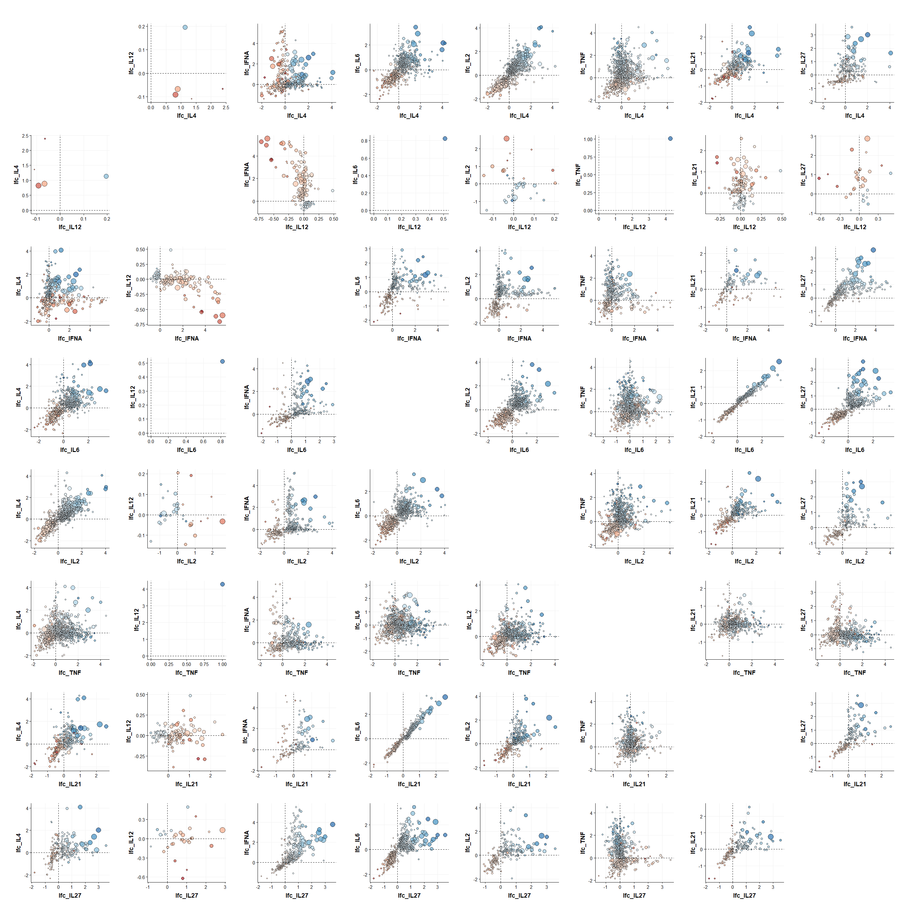<!-- -->

``` r
#ggsave("plots/interactions_xy_plot_glmGamPoi.pdf")
```

## Strong emergent effects

We can try to identify “strong” interaction effects by focusing on those
with the largest difference between the interaction effect coefficient
and the single ligand coefficients from the GLM model. I iterated
through a few different metrics, but many of them were biased towards
genes that have strong LFC in the single ligand conditions (because for
high LFC genes, the interaction effects have higher LFC)

The scores I settled on are included below. Essentially they prioritize
interaction effects by examining the magnitude of the interaction LFC
compared to purely additive LFC.

Note that in this case the coefficients for AB represent the LFC
attributable to the interaction effect specifically. Thus for a
buffering interaction you might have LFC\[A\] = 1, LFC\[B\] = 1,
LFC\[AB\] = -0.2. This means that if you calculated LFC\[AB vs control
expression\], the LFC would not be negative, just that it would be
smaller than expected based on additive LFCs.

Diff_magnitude_2 further de-prioritizes strong dominant interactions
(e.g. LFC\[A\] = -2, LFC\[B\] = 2, LFC\[AB\] = 2). For example, this
interaction would have a very high value in diff_magnitude_1 (2/0) but a
much lower value in diff_magnitude_2 (2/4).

$$
\text{Diff Magnitude 1} = \frac{\lvert\text{LFC[AB]}\rvert}{\lvert \text{(LFC[A]+LFC[B])} \rvert}+1
$$

$$
\text{Diff Magnitude 2} = \frac{\lvert \text{LFC[AB]} \rvert}{\lvert \text{LFC[A]}\rvert\text{+}\lvert\text{LFC[B]}\rvert}+1
$$

These scores provide a somewhat natural interpretation of the magnitude
of emergent effects. Note that **they do not distinguish between
buffering and synergistic interactions**.

- Genes with log2(diff_magnitude_1) = 1: interaction effect at least as
  strong as additive effects
- Genes with log2(diff_magnitude_1) \> 1: interaction effect greater as
  additive effects
- Genes with log2(diff_magnitude_1) \< 1: interaction effect smaller
  than additive effect
- Genes with log2(diff_magnitude_1) = 0: no interaction effect

``` r
# get mean coeff for single ligands per interaction per gene
expectedSingleCoeff <- singlesLfc %>%
  group_by(interaction, name) %>%
  summarise(expected_lfc_single = sum(lfc),
            expected_lfc_abs_single = sum(abs(lfc)),
            .groups = "drop")

# only include interactions with singificant LFC
interSigMerge <- interSig %>%
  select(interaction, name, adj_pval, lfc) %>%
  left_join(expectedSingleCoeff, by = c("interaction","name")) %>%
  mutate(diff_magnitude_1 = (abs(lfc)/abs(expected_lfc_single))+1,
         diff_magnitude_2 = (abs(lfc)/expected_lfc_abs_single)+1) %>%
  arrange(desc(diff_magnitude_2))
interSigMerge %>% filter(abs(lfc) > 0.25 & adj_pval < 0.001) %>% arrange(desc(diff_magnitude_1))
```

    ## # A tibble: 6,293 × 8
    ##    interaction name   adj_pval    lfc expected_lfc_single expected_lfc_abs_sin…¹
    ##    <chr>       <chr>     <dbl>  <dbl>               <dbl>                  <dbl>
    ##  1 IL6_TNF     Nasp   6.75e- 8  0.307            0.000158                 0.124 
    ##  2 IL4_TNF     Pml    4.44e-12 -0.466            0.000449                 0.308 
    ##  3 IL6_TNF     Rinl   1.23e- 6 -0.266            0.000384                 0.0358
    ##  4 IL2_TNF     Zfand6 1.61e-37  0.580           -0.000898                 0.419 
    ##  5 IL6_IL2     Tsc22… 2.06e- 4 -0.272            0.00116                  0.0133
    ##  6 TNF_IL27    Lta4h  2.75e-12 -0.308            0.00171                  0.398 
    ##  7 IL4_TNF     Treml2 5.56e-12  0.412            0.00250                  2.32  
    ##  8 IL4_TNF     Pbxip1 3.62e- 6 -0.492            0.00305                  0.687 
    ##  9 IL4_TNF     Isoc1  9.57e- 4  0.386            0.00295                  0.0423
    ## 10 TNF_IL27    Ssh1   6.37e- 6 -0.301            0.00280                  0.159 
    ## # ℹ 6,283 more rows
    ## # ℹ abbreviated name: ¹​expected_lfc_abs_single
    ## # ℹ 2 more variables: diff_magnitude_1 <dbl>, diff_magnitude_2 <dbl>

``` r
# write_csv(interSigMerge,"analysis_outs/interactions_diff_annotated.csv")
```

``` r
p1 <- interSigMerge %>%
  ggplot(aes(x = lfc, y=log2(diff_magnitude_1))) +
  geom_pointdensity() +
  scale_color_viridis_c() +
  geom_hline(yintercept=1, linetype="dashed", color="red") +
  geom_hline(yintercept=0, linetype="dashed", color="red") +
  xlab("interaction GLM LFC")
p2 <- interSigMerge %>%
  ggplot(aes(x = lfc, y=log2(diff_magnitude_2))) +
  geom_pointdensity() +
  scale_color_viridis_c() +
  geom_hline(yintercept=1, linetype="dashed", color="red") +
  geom_hline(yintercept=0, linetype="dashed", color="red") +
  xlab("interaction GLM LFC")
p3 <- interSigMerge %>%
  ggplot(aes(x = log2(diff_magnitude_1), y=-log10(adj_pval))) +
  geom_pointdensity() +
  scale_color_viridis_c() +
  geom_hline(yintercept=-log10(0.001), linetype="dashed", color="red") +
  geom_vline(xintercept=1, linetype="dashed", color="red") +
  geom_vline(xintercept=0, linetype="dashed", color="red") +
  ylab("-log10(padj)")
p4 <- interSigMerge %>%
  ggplot(aes(x = log2(diff_magnitude_2), y=-log10(adj_pval))) +
  geom_pointdensity() +
  scale_color_viridis_c() +
  geom_hline(yintercept=-log10(0.001), linetype="dashed", color="red") +
  geom_vline(xintercept=1, linetype="dashed", color="red") +
  geom_vline(xintercept=0, linetype="dashed", color="red") +
  ylab("-log10(padj)")
p1+p2+p3+p4+plot_layout(ncol=2)
```

    ## Warning: Removed 7 rows containing non-finite outside the scale range
    ## (`stat_pointdensity()`).
    ## Removed 7 rows containing non-finite outside the scale range
    ## (`stat_pointdensity()`).

<!-- -->

``` r
p1 <- plot_lfc_pair(c("Rorc"),"IL6_TNF", degWilcox)
p2 <- plot_lfc_pair(c("Xdh"),"IL4_IL27", degWilcox)
p3 <- plot_lfc_pair(c("Ptpn13"),"IL4_TNF", degWilcox)
p4 <- plot_lfc_pair(c("H2-DMa"),"IL2_IFNA", degWilcox)
p5 <- plot_lfc_pair(c("Tfap4"),"IL6_TNF", degWilcox)
p6 <- plot_lfc_pair(c("Thrb"),"IL4_TNF", degWilcox)

p1+p2+p3+p4+p5+p6+plot_layout(ncol=3)
```

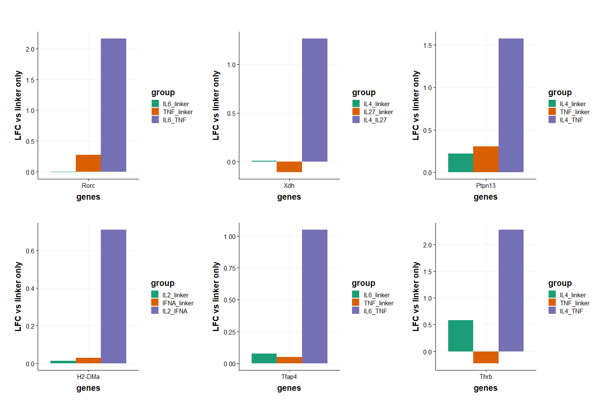<!-- -->

## Specific interesting cases

### IL12 interaction effects

``` r
p1 <- make_xy_plot("IL12_IFNA",
             interactions = interactionsLfc, singles = singlesLfc, p_val_cutoff=0.1) +
  geom_text_repel(aes(label=name), size=2) +
  facet_wrap(~lfc < 0, labeller = as_labeller(c(`TRUE` = "neg interaction LFC", `FALSE` = "pos interaction LFC")))
p2 <- make_xy_plot("IL12_IL27",
             interactions = interactionsLfc, singles = singlesLfc, p_val_cutoff=0.1) +
  geom_text_repel(aes(label=name), size=2) +
  facet_wrap(~lfc < 0, labeller = as_labeller(c(`TRUE` = "neg interaction LFC", `FALSE` = "pos interaction LFC")))
p3 <- make_xy_plot("IL12_IL21",
             interactions = interactionsLfc, singles = singlesLfc, p_val_cutoff=0.1) +
  geom_text_repel(aes(label=name), size=2) +
  facet_wrap(~lfc < 0, labeller = as_labeller(c(`TRUE` = "neg interaction LFC", `FALSE` = "pos interaction LFC")))
p1+p2+p3+plot_layout(ncol=1)
```

    ## Warning: ggrepel: 45 unlabeled data points (too many overlaps). Consider
    ## increasing max.overlaps

    ## Warning: ggrepel: 29 unlabeled data points (too many overlaps). Consider
    ## increasing max.overlaps

    ## Warning: ggrepel: 57 unlabeled data points (too many overlaps). Consider
    ## increasing max.overlaps

    ## Warning: ggrepel: 33 unlabeled data points (too many overlaps). Consider
    ## increasing max.overlaps

<!-- -->

### IL4 IFNA interaction effect

``` r
make_xy_plot("IL4_IFNA",
             interactions = interactionsLfc, singles = singlesLfc, p_val_cutoff=0.1) +
  geom_text_repel(aes(label=name), size=2) +
  facet_wrap(~lfc < 0, labeller = as_labeller(c(`TRUE` = "neg interaction LFC", `FALSE` = "pos interaction LFC")))
```

    ## Warning: ggrepel: 100 unlabeled data points (too many overlaps). Consider
    ## increasing max.overlaps

    ## Warning: ggrepel: 109 unlabeled data points (too many overlaps). Consider
    ## increasing max.overlaps

<!-- -->

### IL2/4 vs IL27 interaction

Does IL27 synergize with IL4 to reinforce Th1 programs?

``` r
p1 <- make_xy_plot("IL4_IL27",
             interactions = interactionsLfc, singles = singlesLfc, p_val_cutoff=0.1) +
  geom_text_repel(aes(label=name), size=2) +
  facet_wrap(~lfc < 0, labeller = as_labeller(c(`TRUE` = "neg interaction LFC", `FALSE` = "pos interaction LFC")))
p2 <- make_xy_plot("IL2_IL27",
             interactions = interactionsLfc, singles = singlesLfc, p_val_cutoff=0.1) +
  geom_text_repel(aes(label=name), size=2) +
  facet_wrap(~lfc < 0, labeller = as_labeller(c(`TRUE` = "neg interaction LFC", `FALSE` = "pos interaction LFC")))
p1+p2+plot_layout(ncol=1)
```

    ## Warning: ggrepel: 72 unlabeled data points (too many overlaps). Consider
    ## increasing max.overlaps

    ## Warning: ggrepel: 102 unlabeled data points (too many overlaps). Consider
    ## increasing max.overlaps

    ## Warning: ggrepel: 77 unlabeled data points (too many overlaps). Consider
    ## increasing max.overlaps

    ## Warning: ggrepel: 97 unlabeled data points (too many overlaps). Consider
    ## increasing max.overlaps

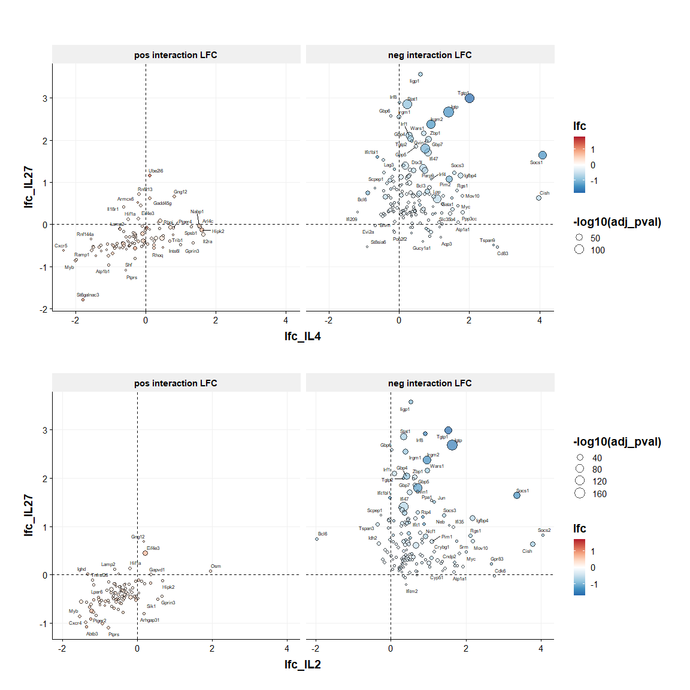<!-- -->

``` r
interSub <- interactionsLfc %>%
  filter(interaction %in% c("IL2_IL27", "IL4_IL27")) %>%
  select(name, adj_pval, lfc, interaction) %>%
  pivot_wider(
    names_from = interaction,
    values_from = c(adj_pval, lfc),
    names_sep = "_"
  )

ggplot(interSub, aes(x = lfc_IL2_IL27, y = lfc_IL4_IL27)) +
  #geom_point() +
  geom_text(aes(label = name), size = 2) +
  geom_hline(yintercept = 0, linetype = "dashed") +
  geom_vline(xintercept = 0, linetype = "dashed")
```

    ## Warning: Removed 1740 rows containing missing values or values outside the scale range
    ## (`geom_text()`).

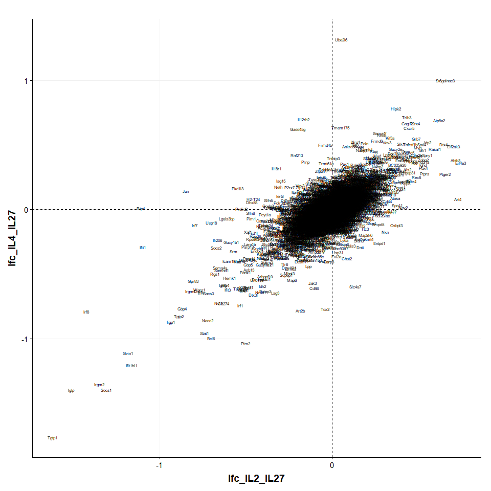<!-- -->

### IL4 vs IL6/IL21 interaction effects

``` r
p1 <- make_xy_plot(
  "IL4_IL6",
  interactions = interactionsLfc,
  singles = singlesLfc,
  p_val_cutoff = 0.1
) +
  geom_text_repel(aes(label = name), size = 2) +
  facet_wrap( ~ lfc < 0, labeller = as_labeller(c(`TRUE` = "neg interaction LFC", `FALSE` = "pos interaction LFC")))
p2 <- make_xy_plot(
  "IL4_IL21",
  interactions = interactionsLfc,
  singles = singlesLfc,
  p_val_cutoff = 0.1
) +
  geom_text_repel(aes(label = name), size = 2) +
  facet_wrap( ~ lfc < 0, labeller = as_labeller(c(`TRUE` = "neg interaction LFC", `FALSE` = "pos interaction LFC")))
p1 / p2
```

    ## Warning: ggrepel: 318 unlabeled data points (too many overlaps). Consider
    ## increasing max.overlaps

    ## Warning: ggrepel: 338 unlabeled data points (too many overlaps). Consider
    ## increasing max.overlaps

    ## Warning: ggrepel: 108 unlabeled data points (too many overlaps). Consider
    ## increasing max.overlaps

    ## Warning: ggrepel: 129 unlabeled data points (too many overlaps). Consider
    ## increasing max.overlaps

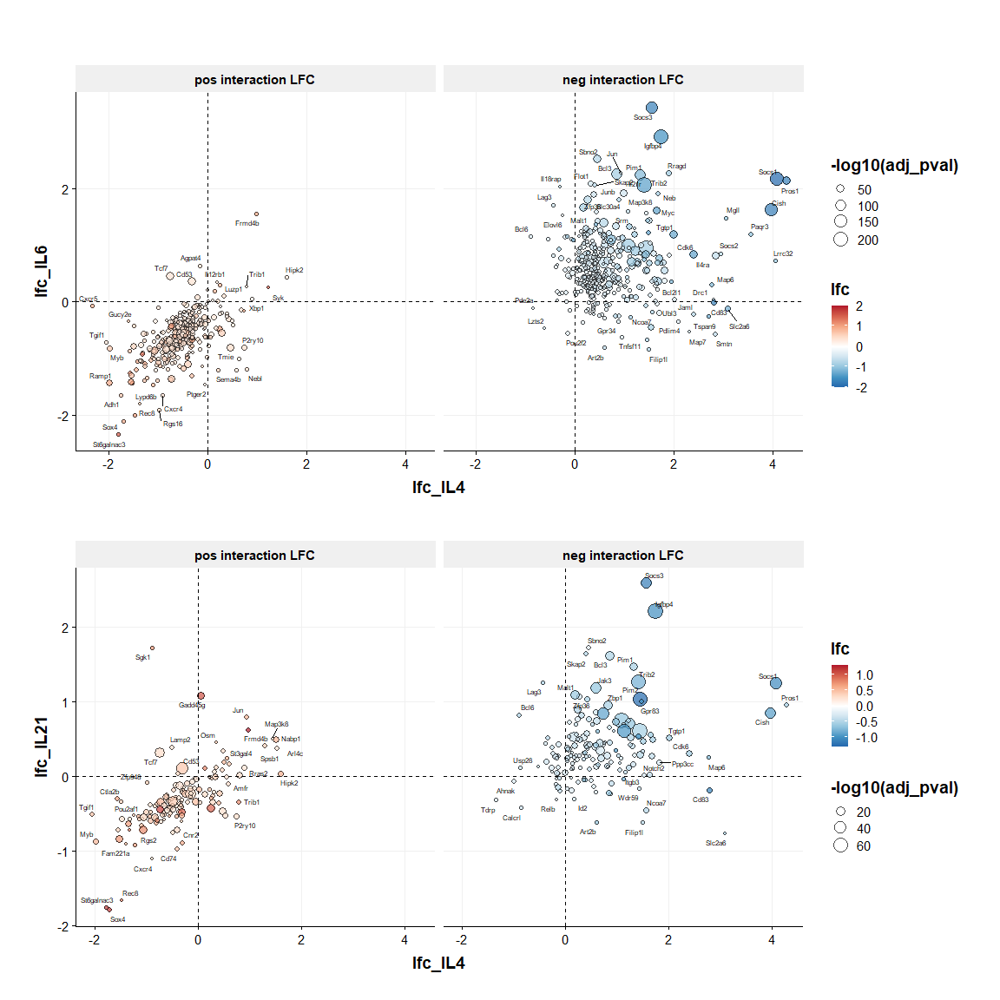<!-- -->

``` r
interSub <- interactionsLfc %>%
  filter(interaction %in% c("IL4_IL6", "IL4_IL21")) %>%
  select(name, adj_pval, lfc, interaction) %>%
  pivot_wider(
    names_from = interaction,
    values_from = c(adj_pval, lfc),
    names_sep = "_"
  )

ggplot(interSub, aes(x = lfc_IL4_IL6, y = lfc_IL4_IL21)) +
  #geom_point() +
  geom_text(aes(label = name), size = 2) +
  geom_hline(yintercept = 0, linetype = "dashed") +
  geom_vline(xintercept = 0, linetype = "dashed") +
  xlim(-2.1,2.1) +
  ylim(-2.1,2.1)
```

    ## Warning: Removed 938 rows containing missing values or values outside the scale range
    ## (`geom_text()`).

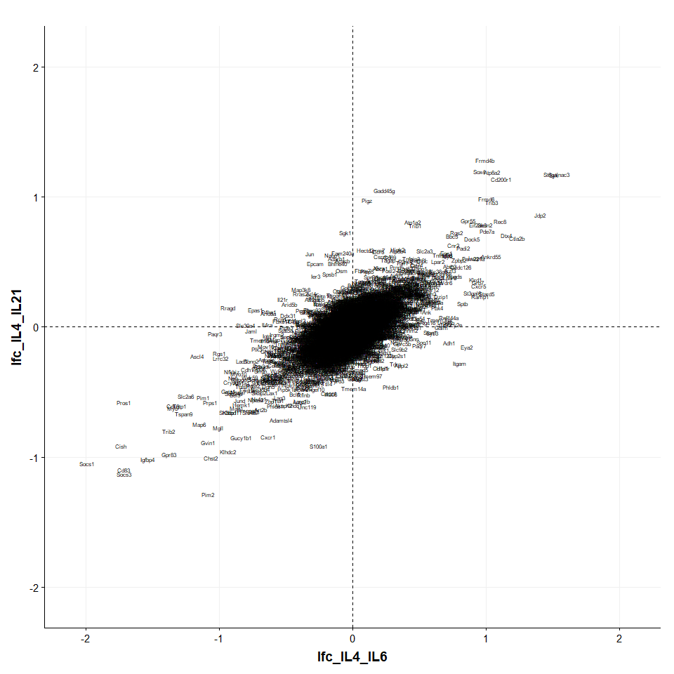<!-- -->

``` r
p1 <- plot_lfc_pair(c("Il4ra","Il21r","Gadd45g","Sgk1","Paqr3","Itgam"),"IL4_IL6", degWilcox)
p2 <- plot_lfc_pair(c("Il4ra","Il21r","Gadd45g","Sgk1","Paqr3","Itgam"),"IL4_IL21", degWilcox)

p1+p2
```

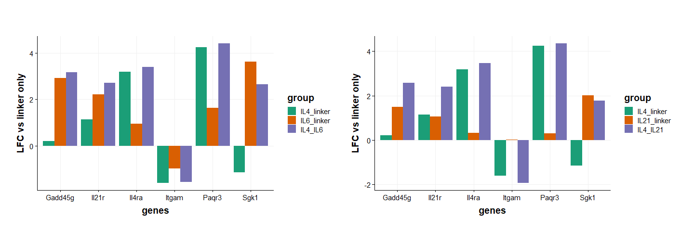<!-- -->
